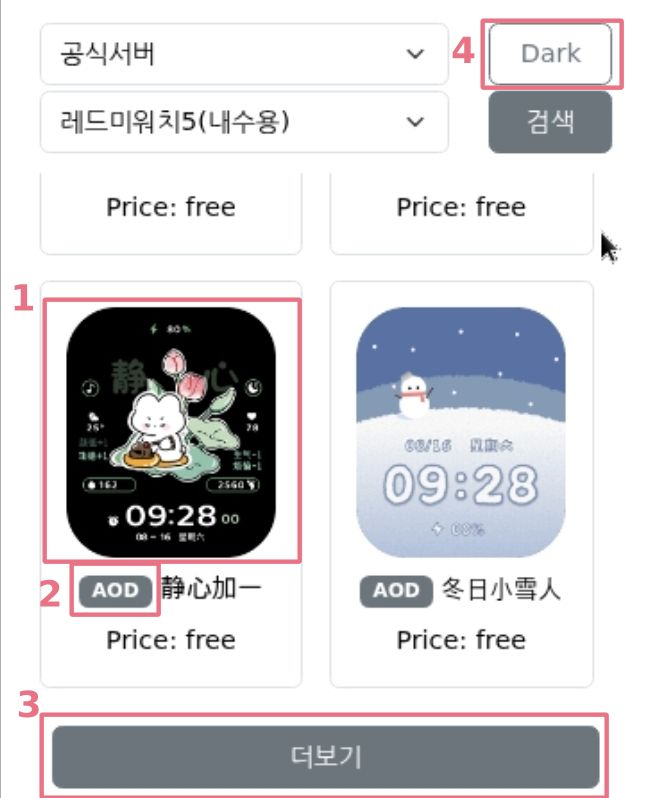
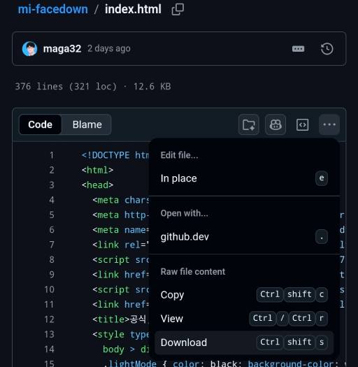
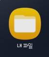
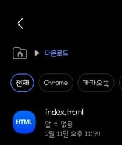
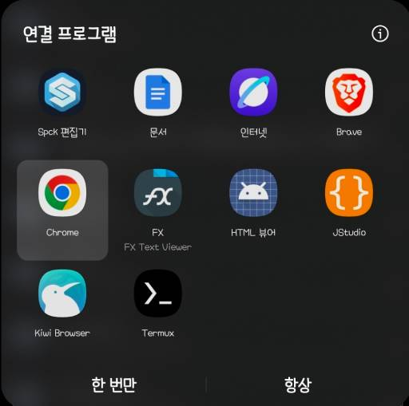

# 샤오미 워치페이스 다운로더
###
###
## 0. 들어가기에 앞서
- 해당 워치페이스를 시계에 설치함으로써 발생하는 기기 오작동 및 모든 불이익에 대해 개발자는 책임을 지지 않습니다.
- 워치페이스 다운로더는 공식, 사설 다운로드 서버에 의존하고 있으며 api 변경 등의 사유로 언제든 서비스가 종료될 수 있습니다.

###
###
## 1. 사용방법(온라인)
### 1.1. [https://mi-facedown.pages.dev](https://mi-facedown.pages.dev/)에 접속해주세요.

### 1.2. 서버와 기종을 선택 후 검색해주세요

### 1.3. 검색 결과

- (1) 이미지 클릭시 워치페이스 다운로드
- (2) AOD존재시 클릭하여 AOD 확인 가능
- (3) 더보기를 클릭하여 추가 로드
- (4) 다크모드/라이트모드 전환가능

###
###
## 2. 사용방법(오프라인)
### * 온라인과의 차이점
- 하단의 광고가 뜨지 않습니다
- 워치의 섬네일을 불러오지 않아 초기화면 로딩이 조금 더 빠릅니다
- 사이트의 큰 변동이 있을때는 재다운로드가 필요합니다
- 400줄 내외의 코드로 조금만 코드를 볼줄 아신다면 직접 커스텀하여 원하는 기능을 추가해볼 수 있습니다

### 2.1. 아래 주소에서 index.html파일을 다운로드 받으세요
> [https://github.com/maga32/mi-facedown/blob/main/index.html](https://github.com/maga32/mi-facedown/blob/main/index.html)

### 2.2.1 PC인 경우
- 다운로드받은 index.html 파일을 더블클릭하여 실행하면 됩니다.

### 2.2.2 안드로이드 휴대폰인 경우

- 내파일을 열어줍니다

- 다운받은 파일을 누릅니다

- 자주쓰는 인터넷 브라우저를 사용해 열어줍니다.(크롬, 네이버, 삼성인터넷 등)

### 2.2.3 이후 온라인 버전과 동일하게 사용가능합니다

###
###
## 3. 워치페이스 설치방법
- 각 기종마다 차이가 있으니 네이버카페 [(https://cafe.naver.com/xst)](https://cafe.naver.com/xst) 등을 통해 확인해주세요

###
###
## 4. 오류 제보
- CORS우회서버를 사용하고 있어 짧은 시간내 연속하여 검색시 오류가 발생할 수 있습니다. 오류시 30초~1분 가량 짧은 텀을 두고 재시도 바랍니다.
- 그 외 오류는 네이버카페 샤오미스토리 원본 게시글에 댓글을 달아주시면 빠르게 확인 가능합니다. [[링크]](https://naver.me/xgXMlc0G)